# Nivetha_Minor_Project
# Forensic Readiness Framework for Serverless Computing (FaaS)

## Overview
Serverless platforms like **AWS Lambda** introduce major digital forensics challenges due to their **ephemeral and stateless execution model**. Traditional forensic methods fail because execution environments disappear immediately after invocation.

This project implements a **forensic readiness framework** that proactively collects, analyzes, and preserves forensic evidence from AWS Lambda executions to support post-incident investigations.

---

## Problem Statement
In Function-as-a-Service (FaaS) environments:

- Execution instances are short-lived  
- No persistent local state exists  
- Logs and configurations are distributed across services  
- Evidence can be lost if not collected proactively  

There is a need for an **automated, lightweight forensic readiness mechanism** for serverless systems.

---

## Proposed Solution
This project introduces a **forensic-ready pipeline** that:

- Collects configuration snapshots of Lambda functions  
- Extracts and processes runtime execution logs  
- Performs rule-based anomaly detection  
- Automatically packages forensic evidence into a tamper-evident bundle  
- Stores all evidence securely in encrypted and versioned S3 storage  

The framework is **non-intrusive**, requires **no modification to the target Lambda function**, and supports automated evidence preservation.

---

## System Architecture (High-Level Pipeline)

### 1. Lambda Function Execution
- Target Lambda functions (normal and anomalous) are invoked.

### 2. Configuration Snapshot Module
- Captures static configuration details (IAM role, runtime, memory, environment variables).
- Stores snapshots in S3.

### 3. Log Collector Module
- Retrieves runtime logs from CloudWatch.
- Parses execution metrics (errors, duration, invocations).
- Stores structured logs in S3.

### 4. Anomaly Detection Module
- Automatically fetches the latest runtime logs from S3.
- Applies rule-based thresholds to detect abnormal behavior.

### 5. Evidence Packager Module
- Automatically retrieves configuration snapshots, logs, and anomaly results.
- Generates a unified forensic evidence bundle.
- Computes a SHA-256 integrity hash.
- Uploads the final bundle to S3.

---

## Implemented Modules

### 1. Configuration Snapshot Module
- Captures Lambda configuration at runtime.
- Ensures static forensic evidence is preserved.
- Handles the ephemeral nature of serverless systems.

**Technologies:** Python, boto3, AWS Lambda, IAM, S3

---

### 2. Log Collector Module
- Extracts runtime execution logs from CloudWatch.
- Converts raw logs into structured forensic data.
- Enables behavioral analysis.

**Technologies:** Python, boto3, CloudWatch, S3

---

### 3. Anomaly Detection Module (Rule-Based)
- Automatically analyzes the most recent Lambda execution.
- Uses baseline-derived thresholds to detect anomalies.
- Designed to handle missing or partial log data robustly.

**Detection Parameters:**
- Error count  
- Execution duration  
- Invocation frequency  

---

### 4. Evidence Packager Module
- Fully automated evidence correlation.
- Generates a self-descriptive forensic case file.
- Ensures integrity using SHA-256 hashing.
- Stores evidence in encrypted S3 storage.

---

## Automation Strategy
- Evidence collection and analysis operate without manual intervention.
- Modules retrieve required data directly from S3.
- The pipeline analyzes the **most recent execution**, aligning with real-world automated forensic readiness.
- Event-driven orchestration and ML-based detection are planned as future enhancements.

---

## Demo Workflow

### 1. Invoke a Normal Lambda Function

### 2. Run the Forensic Pipeline
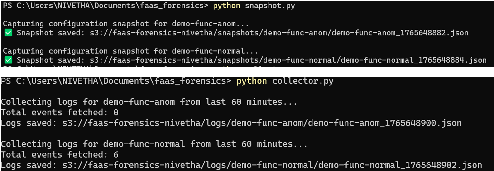

### 3. Observe Results
- No anomaly detected
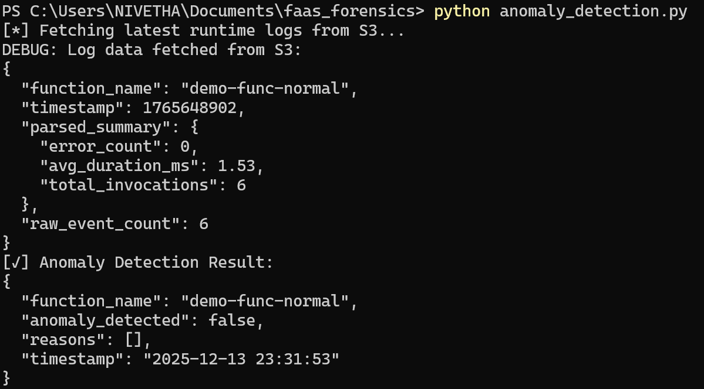  
- Evidence bundle generated
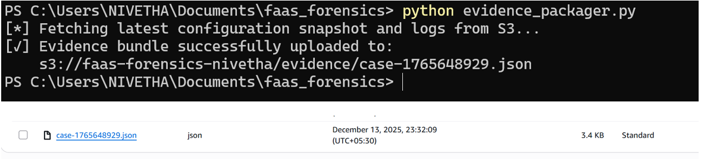 

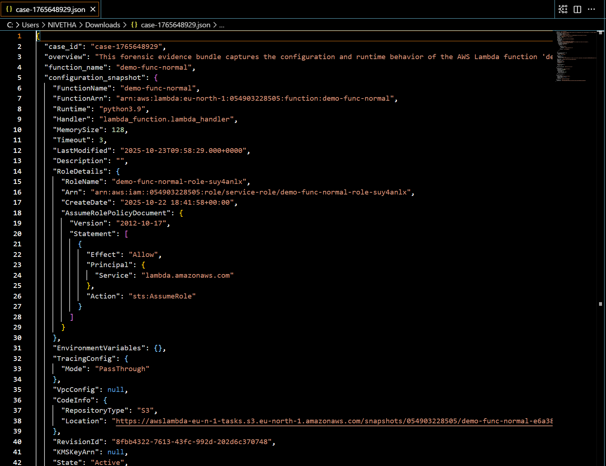 

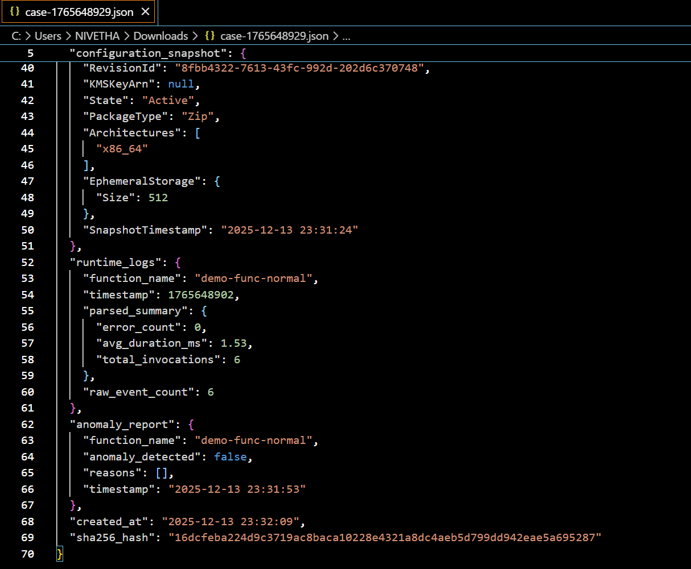

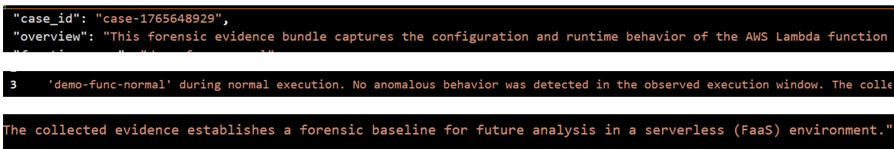 

---

### 4. Invoke an Anomalous Lambda Function
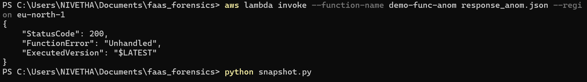

### 5. Run the Forensic Pipeline Again
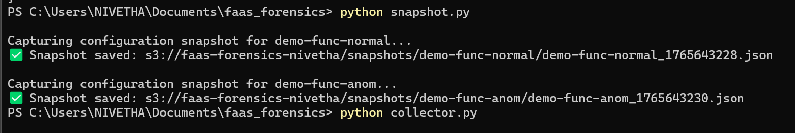
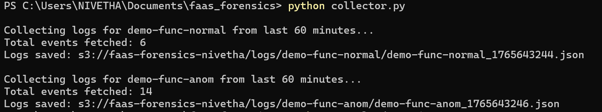

### 6. Observe Results
- Anomaly detected
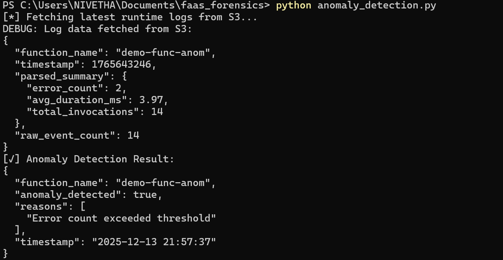 
- Updated evidence bundle with dynamic case summary
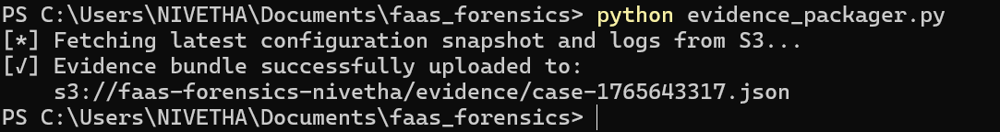
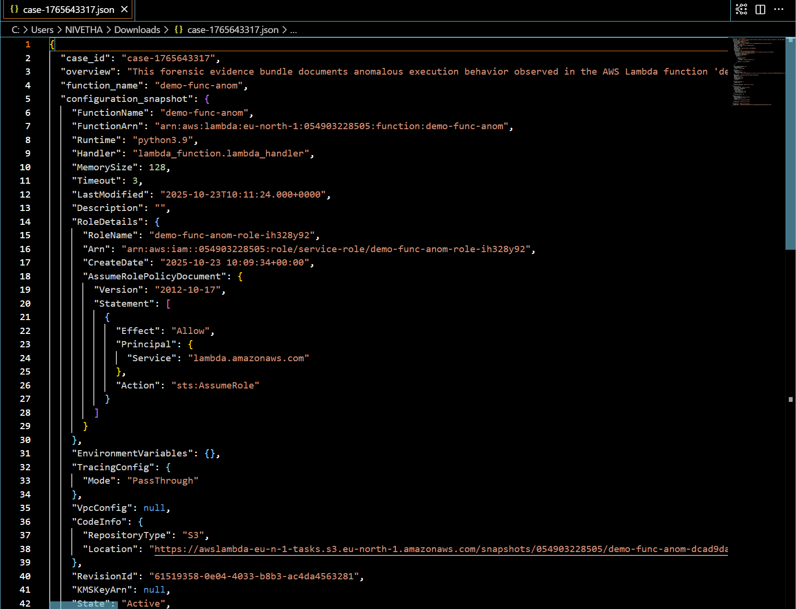 
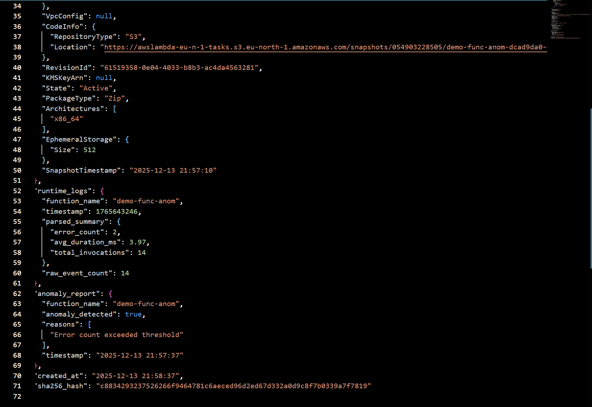 
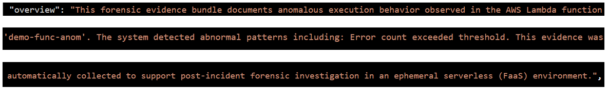 

---

## Scope Clarification

### Minor Project (Current Work)
- Forensic readiness framework  
- Rule-based anomaly detection  
- Automated evidence packaging  
- Controlled demonstration environment  

### Major Project (Future Work)
- Event-driven execution using AWS triggers  
- ML-based anomaly detection  
- Continuous monitoring  
- Multi-function scalability  
- Advanced forensic correlation  

---

## Technologies Used
- AWS Lambda  
- AWS CloudWatch  
- AWS S3  
- AWS IAM  
- Python  
- boto3  

---

## Conclusion
This project demonstrates that **forensic readiness in serverless environments** is achievable through proactive evidence collection and automated analysis. By addressing the inherent challenges of FaaS platforms, the framework lays a strong foundation for intelligent, event-driven forensic systems in cloud-native architectures.
